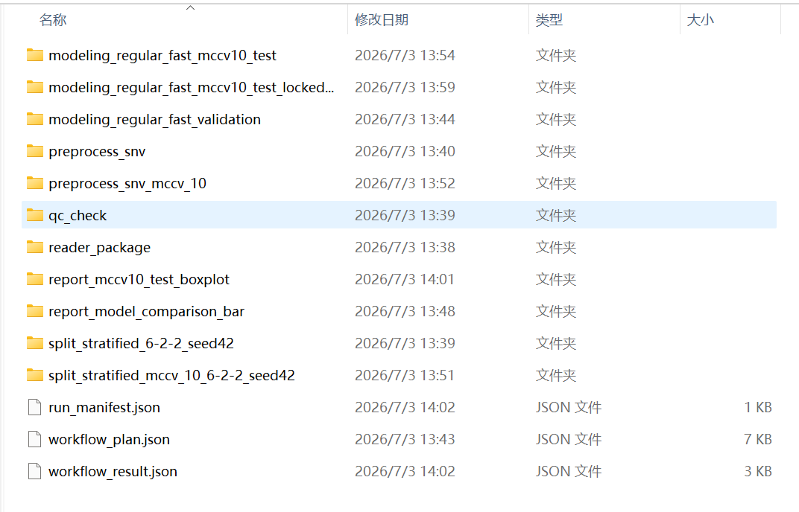
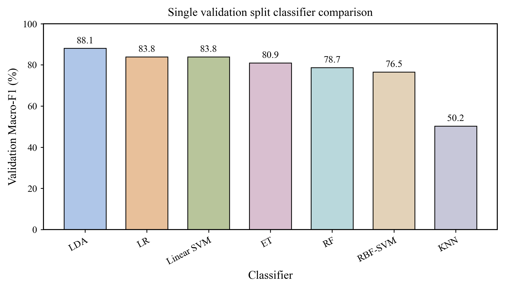
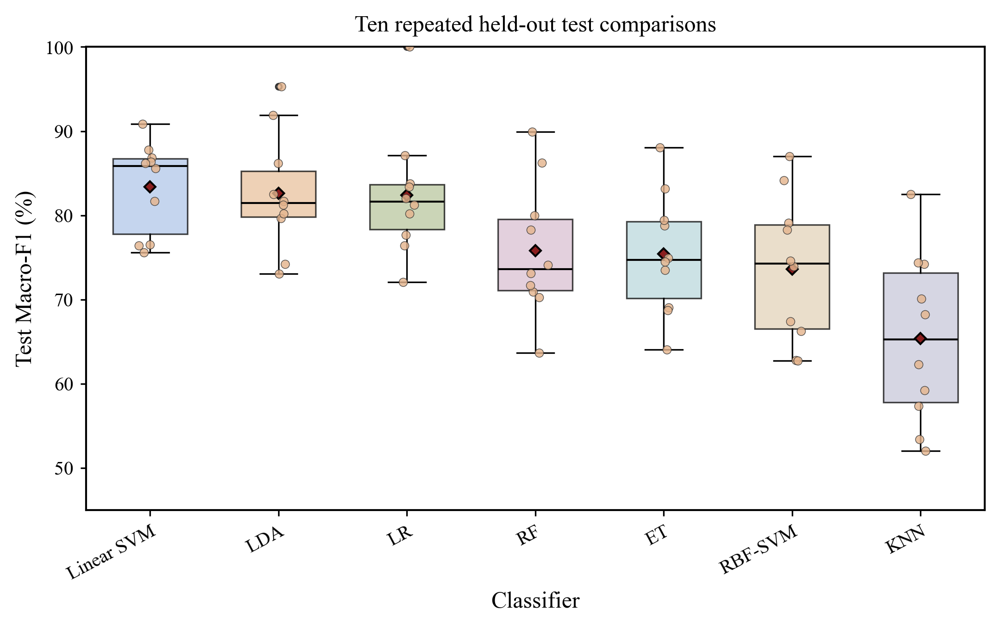
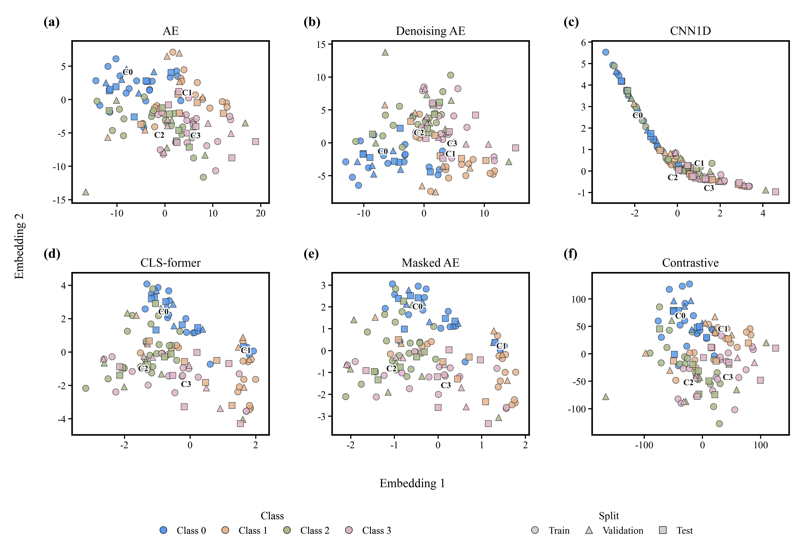

# Spectral Skills

Spectral Skills 是面向 Codex、Claude 等智能体环境的光谱数据分析插件系统。它把光谱数据读取、光谱数据质量检查、光谱数据划分、光谱数据预处理、特征工程、分类/回归建模、预处理、特征工程和建模组合的自动优化、科研绘图与报告输出拆分为职责明确的技能模块，并通过稳定脚本完成实际计算。

本项目的目标不是把所有步骤隐藏起来，而是让用户在自然语言交互中完成可追踪、可复跑的光谱分析。系统会在样本方向、标签对齐、异常样本处理、划分方式、预处理参数、候选方法范围、自动优化规模和最终测试等关键位置暂停确认。测试集只在处理流程和模型参数锁定后用于最终评估，不参与方法选择或参数调整。

---

## 中文说明

### 核心能力

- **光谱数据读取**：读取表格、工作簿、科学容器文件和逐样本文件夹，识别样本、标签、波段轴和元数据，生成统一的标准光谱数据包。
- **光谱数据质量检查**：检查缺失值、非法值、异常样本候选、重复样本、波段风险、类别或目标值风险；默认只标记风险，不自动删除样本或波段。
- **光谱数据划分**：支持训练集、验证集、测试集划分，交叉验证，重复划分，代表性划分和分组划分，并保存固定样本归属。
- **光谱数据预处理**：支持散射校正、平滑、导数、基线校正、缩放、归一化、吸光度转换和波段裁剪。
- **特征工程**：支持降维、变量选择、统计筛选、投影、信号变换、高维可视化和深度光谱表征。
- **分类/回归建模**：支持传统机器学习、化学计量学模型、可选增强学习库、小样本自创模型和深度模型。
- **预处理、特征工程和建模组合的自动优化**：在用户确认的方法范围和运行规模内，比较多种预处理、特征工程和模型组合，按照验证集或训练集内部交叉验证指标选择最终流程。
- **科研绘图与报告输出**：读取各阶段结果，生成可编辑图件、预览图、源数据、图注、绘图代码和检查记录。

### 工作流程

```text
原始光谱数据
    |
    v
光谱数据读取
    |
    v
光谱数据质量检查
    |
    v
光谱数据划分
    |
    v
光谱数据预处理
    |
    v
特征工程
    |
    v
分类/回归建模
    |
    v
最终测试评估与科研绘图

预处理、特征工程和建模组合的自动优化可以在划分之后调用，
统一比较多个候选组合，并把排名、参数和最终流程写入结果文件。
```

阶段之间通过标准表格文件和阶段说明文件交接，不依赖临时内存状态。每个阶段都会保存输入来源、处理参数、随机种子、结果文件和警告信息，便于后续复查和继续运行。

### 九个核心技能

| 技能 | 中文职责 | 主要输出 |
| --- | --- | --- |
| `spectral-reader` | 光谱数据读取与标准化 | `X.csv`、`y.csv`、`sample_ids.csv`、`band_axis.csv`、`metadata.csv`、`data_contract.json` |
| `spectral-check` | 光谱数据质量检查和确认后清理 | `qc_result.json`、`cleaned_package`、`qc_cleaning_log.json` |
| `spectral-splitter` | 光谱数据划分 | `split_indices.csv`、`split_contract.json`、`split_summary.json` |
| `spectral-preprocess` | 光谱数据预处理 | 预处理后的数据包、`preprocess_state.json`、`preprocess_contract.json` |
| `spectral-feature` | 特征工程、降维和变量选择 | 特征数据包、`feature_state.json`、`feature_contract.json` |
| `spectral-modeling` | 分类/回归建模、参数选择和最终评估 | 指标、预测结果、模型文件、建模说明文件 |
| `spectral-optimizer` | 预处理、特征工程和建模组合的自动优化 | 候选组合清单、候选组合结果表、最佳流程、推荐报告 |
| `spectral-report` | 科研绘图和报告输出 | 图件、源数据、图注、绘图代码、检查记录 |
| `spectral-workflow` | 路线规划、阶段续跑和关键确认 | `workflow_plan.json`、`workflow_result.json` |

### 统一运行目录

同一次分析产生的文件会收敛到一个运行目录下，避免在原始数据旁边散落多个中间文件夹。

```text
spectral_runs/
└── 数据集名称/
    └── 运行名称/
        ├── reader_package/
        ├── qc_output/
        ├── split_output/
        ├── preprocess_output/
        ├── feature_output/
        ├── model_output/
        ├── optimizer_output/
        ├── report_output/
        ├── logs/
        ├── workflow_plan.json
        └── workflow_result.json
```

### 关键原则

- 测试集只在最终流程锁定后访问一次，用于最终泛化能力评估。
- 需要从数据中学习统计量或参数的方法只在训练集上拟合，再应用到验证集和测试集。
- 自动优化必须先确认候选方法范围、参数范围、运行规模和选择指标。
- 深度特征和自创小样本模型可以进入同一个组合优化过程，与预处理和特征工程方法一起比较，而不是单独运行后手工拼接结果。
- 可比较的方法范围、每一次候选组合运行记录、选择指标、最佳参数和最终处理流程都会写入结果文件。

---

## 方法池

### 光谱数据读取方法池

| 方法类别 | 方法 | 适用场景 | 公开/自创 |
| --- | --- | --- | --- |
| 文本与工作簿 | CSV、TSV、TXT、Excel、ODS | 常见仪器导出表、表头前含注释、多工作表文件 | 公开方法 |
| 科学容器 | NPY、NPZ、MAT、HDF5、NetCDF | 矩阵、变量或数据集路径形式的数据 | 公开方法 |
| 标签与元数据 | 外部标签对齐、目标值读取、元数据读取、波段轴读取 | 标签、目标值、样本信息与光谱分开存放 | 自创方法 |
| 逐样本目录 | 每个样本一个文件、从文件名或目录名提取标签 | 样本以文件夹形式组织 | 自创方法 |
| 布局识别 | 样本行/列识别、多行表头识别、连续数值波段块识别 | 光谱列前后夹杂样本编号、标签、目标值或元数据 | 自创方法 |
| 标准输出 | 标准光谱数据包 | 统一交给后续质量检查、划分、预处理和建模使用 | 自创方法 |

### 光谱数据质量检查方法池

| 方法类别 | 方法 | 适用场景 | 公开/自创 |
| --- | --- | --- | --- |
| 基础完整性 | 文件一致性、行列一致性、缺失值、非法值、类别数量、目标值异常、常量波段、低方差波段 | 检查标准数据包是否可以进入后续分析 | 自创方法 |
| 稳健统计 | 稳健 Z 分数、四分位距、中位数绝对偏差 | 统计摘要层面的异常候选识别 | 公开方法 |
| 相似性检查 | 均值相似性、类内相似性 | 发现全局或类内谱形偏离 | 自创方法 |
| 谱形风险 | 尖峰检测、基线漂移评分 | 局部突变、仪器尖峰和慢变背景风险 | 自创方法 |
| 主成分异常 | Hotelling T²、Q 残差、主成分空间马氏距离 | 多变量空间异常候选 | 公开方法 |
| 重复风险 | 完全重复、近重复检查 | 重复样本、标签冲突和潜在划分问题 | 自创方法 |
| 稳定性异常 | 多方法共识、半采样异常、蒙特卡洛交叉验证异常 | 高级不稳定样本分析，不自动等同坏光谱 | 自创方法 |
| 确认后清理 | 删除样本或波段、均值/中位数插补、线性/最近邻插值、Hampel 修复、局部中位数绝对偏差修复 | 用户确认动作、阈值和范围后执行 | 公开方法 |

### 光谱数据划分方法池

| 方法类别 | 方法 | 适用场景 | 公开/自创 |
| --- | --- | --- | --- |
| 留出法 | 随机留出、分层留出 | 普通训练/验证/测试划分；分类任务保持类别比例 | 公开方法 |
| 指定集合 | 预定义划分 | 已有划分列、外部验证集或指定样本 | 公开方法 |
| 交叉验证 | K 折、分层 K 折、留一法 | 常规评估、小样本分类、极小样本评估 | 公开方法 |
| 重复评估 | 蒙特卡洛交叉验证、重复随机划分、分层蒙特卡洛交叉验证 | 重复随机评估和分类比例保持 | 公开方法 |
| 代表性划分 | Kennard-Stone、SPXY、Duplex | 覆盖光谱空间、兼顾连续目标值或构造代表性训练/测试集合 | 公开方法 |
| 连续目标分层 | 回归分箱分层、目标值分箱分层 | 将连续目标值划分为区间后保持分布 | 自创方法 |
| 组隔离 | 分组划分、组感知划分、分层分组划分 | 批次、受试者或重复测量样本不能跨集合 | 公开方法 |

### 光谱数据预处理方法池

| 方法类别 | 方法 | 适用场景 | 公开/自创 |
| --- | --- | --- | --- |
| 散射与趋势校正 | 无预处理、标准正态变量校正、多元散射校正、去趋势、标准正态变量校正加去趋势 | 散射差异、基线趋势和显式基线对照 | 公开方法 |
| 平滑与导数 | Savitzky-Golay 平滑、一阶导数、二阶导数、移动平均、高斯平滑、中值滤波 | 降噪、峰形增强和局部异常抑制 | 公开方法 |
| 基线校正 | 线性基线、多项式基线、橡皮筋基线、非对称最小二乘基线 | 慢变背景和荧光基线校正 | 公开方法 |
| 缩放与归一化 | 均值中心化、标准化、最小最大缩放、稳健缩放、帕累托缩放、L2 归一化、面积归一化、最大绝对值归一化 | 统一量纲、样本强度或面积 | 公开方法 |
| 物理转换与波段处理 | 反射率转吸光度、透射率转吸光度、对数变换、波段范围选择、指定波段范围删除 | 吸光度转换和物理波段裁剪 | 公开方法 |

### 特征工程方法池

| 方法类别 | 方法 | 适用场景 | 公开/自创 |
| --- | --- | --- | --- |
| 基础降维与解释 | 无特征工程、主成分分析、偏最小二乘潜变量、变量投影重要性 | 降维、潜变量表达和变量解释 | 公开方法 |
| 统计筛选 | KBest、方差分析 F 检验、回归 F 检验、方差阈值筛选 | 分类/回归单变量筛选和低方差剔除 | 公开方法 |
| 投影选波段 | 连续投影算法、竞争性自适应重加权采样 | 降低共线性并选择关键波段组合 | 公开方法 |
| 无信息剔除 | 无信息变量剔除、蒙特卡洛无信息变量剔除 | 基于稳定性剔除无信息变量 | 公开方法 |
| 区间方法 | 区间偏最小二乘 | 按连续谱段比较局部信息 | 公开方法 |
| 相关筛选 | 相关性筛选 | 按标签或目标值相关性筛选变量 | 公开方法 |
| 物理指定 | 波段范围选择、波段索引选择 | 有明确先验波段或需要复现实验波段 | 公开方法 |
| 非线性与稀疏投影 | 核主成分分析、稀疏主成分分析 | 非线性投影和稀疏载荷 | 公开方法 |
| 矩阵与监督投影 | 非负矩阵分解、独立成分分析、线性判别投影 | 非负表达、独立成分和监督降维 | 公开方法 |
| 信号变换 | 离散余弦变换、快速傅里叶变换 | 频域或压缩域逐样本特征 | 公开方法 |
| 稀疏表示 | 字典学习 | 稀疏字典表示和局部谱形组合 | 公开方法 |
| 高维可视化 | Isomap、局部线性嵌入、t-SNE、UMAP | 非线性结构探索；二维图只用于观察结构 | 公开方法 |
| 深度基础表征 | 自编码器、去噪自编码器、一维卷积网络、ResNet1D 光谱嵌入 | 非线性、去噪、卷积和残差表征 | 公开方法 |
| 项目深度扩展 | CLS-former、掩码光谱自编码器、对比光谱嵌入 | 小样本光谱表征，需要确认训练规模和过拟合风险 | 自创方法 |

### 分类建模方法池

| 方法类别 | 方法 | 适用场景 | 公开/自创 |
| --- | --- | --- | --- |
| 线性与判别模型 | 逻辑回归、线性支持向量机、线性判别分析、二次判别分析 | 快速基线、低样本和可解释分类 | 公开方法 |
| 核方法与邻域方法 | 径向基支持向量机、K 近邻分类器 | 非线性边界和邻域分类 | 公开方法 |
| 概率与化学计量模型 | 高斯朴素贝叶斯、偏最小二乘判别分析、软独立建模分类 | 概率基线、偏最小二乘判别和类别建模 | 公开方法 |
| 树集成 | 随机森林、极端随机树、梯度提升分类器 | 非线性变量交互和稳健基线 | 公开方法 |
| 可选增强模型 | XGBoost、LightGBM、CatBoost 分类器 | 安装可选依赖后的强基线 | 公开方法 |
| 神经网络 | 多层感知机分类器 | 小规模非线性模型比较 | 公开方法 |
| 项目小样本扩展 | 深度核学习高斯过程分类器、原型光谱分类器、CLS-former 分类器、CLS-former 嵌入加支持向量机 | 小样本光谱的概率、原型和轻量 Transformer 分类 | 自创方法 |

### 回归建模方法池

| 方法类别 | 方法 | 适用场景 | 公开/自创 |
| --- | --- | --- | --- |
| 化学计量模型 | 偏最小二乘回归、主成分回归 | 高维共线光谱的主力回归基线 | 公开方法 |
| 线性与正则模型 | 线性回归、岭回归、Lasso、弹性网、贝叶斯岭回归 | 快速可解释、稀疏或稳定回归 | 公开方法 |
| 核方法、邻域方法与概率模型 | 支持向量回归、K 近邻回归、高斯过程回归 | 非线性、邻域和不确定性回归 | 公开方法 |
| 树集成 | 随机森林回归、极端随机树回归、梯度提升回归 | 非线性关系和变量交互 | 公开方法 |
| 可选增强模型 | XGBoost、LightGBM、CatBoost 回归器 | 安装可选依赖后的强基线 | 公开方法 |
| 项目小样本扩展 | 深度核学习高斯过程回归器、原型光谱回归器、CLS-former 回归器 | 小样本光谱的概率、原型和 Transformer 回归扩展 | 自创方法 |
| 评价输出 | 决定系数、平均绝对误差、均方根误差、平均绝对百分比误差、不确定性摘要 | 回归性能评价、预测导出和不确定性报告 | 公开方法 |

### 自动优化方法池

| 方法类别 | 方法 | 适用场景 | 公开/自创 |
| --- | --- | --- | --- |
| 候选推荐 | 按数据画像推荐 | 依据样本量、特征量、任务类型和类别分布给出推荐路线，不运行模型 | 自创方法 |
| 单方法调参 | 固定上下游，只调整一个方法的参数 | 用户只想比较一个方法的参数范围 | 自创方法 |
| 单阶段比较 | 固定上下游，只比较预处理、特征或模型中的一个阶段 | 用户想知道某一阶段哪个方法更合适 | 自创方法 |
| 多阶段优化 | 联合搜索预处理、特征工程和建模组合 | 在用户确认的候选范围和运行规模内选择最佳流程 | 自创方法 |
| 仅模型参数调优 | 固定预处理和特征，仅调分类器或回归器 | 先做快速模型基线 | 自创方法 |
| 传统特征加模型调优 | 比较主成分、偏最小二乘潜变量、变量投影重要性、KBest、连续投影算法等 | 传统光谱建模组合比较 | 自创方法 |
| 深度光谱表征加模型调优 | 比较深度嵌入维度、训练参数和下游模型 | 需要明确确认训练规模和计算成本 | 自创方法 |

---

## 演示效果图

以下图片来自项目终期 PPT 的实际运行演示材料，用于展示 `spectral-report` 和流程结果的输出形式。

### 运行目录结构



### 不同分类器精度对比



### 十次独立训练的分类器精度箱线图



### 二维数据分布可视化



---

## 安装与使用

### 从 GitHub 安装到 Codex

```powershell
python "$HOME\.codex\skills\.system\skill-installer\scripts\install-skill-from-github.py" --repo XY041216/spectral-skills --path plugins/spectral-skills
```

也可以克隆仓库后在本地检查插件：

```powershell
git clone https://github.com/XY041216/spectral-skills.git
cd spectral-skills
python install\check_codex_plugin.py --json
```

### 典型使用方式

用户可以直接在智能体环境中描述任务，例如：

```text
处理这个光谱数据 "E:\data\Tablet_ext_0-3.csv"
```

系统读取后会给出下一步路线，例如推荐基线、只做质量检查、逐阶段手动选择方法、预处理/特征工程/建模组合的自动优化、深度模型实验和可视化探索。用户确认路线后再继续执行。

---

## English Version

Spectral Skills is a spectral data analysis plugin system for agent environments such as Codex and Claude. It covers spectral data reading, spectral data quality checking, spectral data splitting, spectral data preprocessing, feature engineering, classification/regression modeling, automated optimization of preprocessing-feature-modeling combinations, and scientific figure/report generation.

The system is designed for transparent and reproducible analysis. It pauses for user confirmation at key points such as sample orientation, label alignment, suspicious sample handling, split strategy, preprocessing parameters, candidate method ranges, optimization scale, and final test evaluation. The test set is used only after the processing pipeline and model parameters are locked; it is not used for method selection or parameter tuning.

### Main Capabilities

- **Spectral data reading**: read tables, spreadsheets, scientific containers, and one-file-per-sample folders; identify samples, labels, band axes, and metadata; produce a standard spectral data package.
- **Spectral data quality checking**: check missing values, illegal values, suspicious outliers, duplicate samples, band risks, and class or target risks; mark issues by default instead of deleting samples or bands automatically.
- **Spectral data splitting**: create reproducible train/validation/test splits, cross-validation folds, repeated splits, representative splits, and group-aware splits.
- **Spectral data preprocessing**: support scatter correction, smoothing, derivatives, baseline correction, scaling, normalization, absorbance conversion, and band selection.
- **Feature engineering**: support dimensionality reduction, variable selection, statistical filtering, projection, signal transforms, high-dimensional visualization, and deep spectral embeddings.
- **Classification/regression modeling**: support traditional machine learning, chemometric models, optional boosting libraries, self-developed small-sample models, and deep models.
- **Automated optimization of preprocessing-feature-modeling combinations**: compare confirmed combinations under a confirmed run scale, then select the final pipeline by validation or train-only cross-validation metrics.
- **Scientific figures and reports**: generate editable figures, preview images, source data, captions, plotting code, and inspection records.

### Workflow

```text
Raw spectral data
    |
    v
Spectral data reading
    |
    v
Spectral data quality checking
    |
    v
Spectral data splitting
    |
    v
Spectral data preprocessing
    |
    v
Feature engineering
    |
    v
Classification/regression modeling
    |
    v
Final test evaluation and scientific reporting

Automated optimization of preprocessing-feature-modeling combinations can be
called after splitting. It ranks confirmed candidate combinations and records
the selected parameters and final pipeline.
```

Stages exchange standard CSV files and stage description files instead of relying on temporary in-memory state. Each stage records input sources, processing parameters, random seeds, output files, and warnings so that the analysis can be inspected and resumed.

### Core Skills

| Skill | Responsibility | Main outputs |
| --- | --- | --- |
| `spectral-reader` | Spectral data reading and standardization | `X.csv`, `y.csv`, `sample_ids.csv`, `band_axis.csv`, `metadata.csv`, `data_contract.json` |
| `spectral-check` | Spectral data quality checking and confirmed cleaning | `qc_result.json`, `cleaned_package`, `qc_cleaning_log.json` |
| `spectral-splitter` | Spectral data splitting | `split_indices.csv`, `split_contract.json`, `split_summary.json` |
| `spectral-preprocess` | Spectral data preprocessing | Preprocessed package, `preprocess_state.json`, `preprocess_contract.json` |
| `spectral-feature` | Feature engineering, dimensionality reduction, and variable selection | Feature package, `feature_state.json`, `feature_contract.json` |
| `spectral-modeling` | Classification/regression modeling, parameter selection, and final evaluation | Metrics, predictions, model files, modeling description files |
| `spectral-optimizer` | Automated optimization of preprocessing-feature-modeling combinations | Candidate list, candidate result table, best pipeline, recommendation report |
| `spectral-report` | Scientific figure and report generation | Figures, source data, captions, plotting code, inspection records |
| `spectral-workflow` | Route planning, stage resume, and key confirmations | `workflow_plan.json`, `workflow_result.json` |

### Run Directory Layout

All files created in one analysis are collected under one run directory:

```text
spectral_runs/
└── dataset_name/
    └── run_name/
        ├── reader_package/
        ├── qc_output/
        ├── split_output/
        ├── preprocess_output/
        ├── feature_output/
        ├── model_output/
        ├── optimizer_output/
        ├── report_output/
        ├── logs/
        ├── workflow_plan.json
        └── workflow_result.json
```

### Method Pools

#### Spectral data reading

| Category | Methods | Use cases | Public/self-developed |
| --- | --- | --- | --- |
| Text files and spreadsheets | CSV, TSV, TXT, Excel, ODS | Common instrument exports, commented headers, and multi-sheet files | Public |
| Scientific containers | NPY, NPZ, MAT, HDF5, NetCDF | Matrix, variable, or dataset-path based data | Public |
| Labels and metadata | External label alignment, target reading, metadata reading, band-axis reading | Labels, targets, sample metadata, and spectra stored separately | Self-developed |
| One-file-per-sample folders | Folder import with labels from file names or folder names | Sample-wise spectral files organized in directories | Self-developed |
| Layout recognition | Sample-row/sample-column recognition, multi-row headers, continuous numeric band block detection | Spectral columns mixed with sample IDs, labels, targets, or metadata | Self-developed |
| Standard output | Standard spectral data package | Unified input for downstream checking, splitting, preprocessing, and modeling | Self-developed |

#### Spectral data quality checking

| Category | Methods | Use cases | Public/self-developed |
| --- | --- | --- | --- |
| Basic integrity | Package consistency, row/column consistency, missing values, illegal values, class counts, target risks, constant bands, low-variance bands | Check whether the standard package can enter downstream analysis | Self-developed |
| Robust statistics | Robust Z-score, interquartile range, median absolute deviation | Statistical outlier candidates | Public |
| Similarity checks | Similarity to mean, classwise similarity | Global or within-class spectral shape deviation | Self-developed |
| Spectral-shape risks | Spike detection, baseline drift score | Local jumps, instrument spikes, and slow background drift | Self-developed |
| Principal-component outliers | Hotelling T², Q residual, Mahalanobis distance on principal components | Multivariate outlier candidates | Public |
| Duplicate risks | Exact duplicates, near-duplicate check | Duplicate samples, label conflicts, and possible split issues | Self-developed |
| Stability outliers | Multi-method consensus, half-resampling outlier analysis, Monte Carlo cross-validation outlier analysis | Advanced unstable-sample analysis, not automatic sample deletion | Self-developed |
| Confirmed cleaning | Sample or band deletion, mean/median imputation, linear/nearest interpolation, Hampel repair, local median absolute deviation repair | Executed only after user confirmation of actions, thresholds, and ranges | Public |

#### Spectral data splitting

| Category | Methods | Use cases | Public/self-developed |
| --- | --- | --- | --- |
| Holdout | Random holdout, stratified holdout | General train/validation/test split; class-ratio preservation | Public |
| Predefined sets | Predefined split | Existing split column, external validation set, or assigned samples | Public |
| Cross-validation | K-fold, stratified K-fold, leave-one-out | Standard evaluation, small-sample classification, very small datasets | Public |
| Repeated evaluation | Monte Carlo cross-validation, repeated random split, stratified Monte Carlo cross-validation | Repeated random evaluation and class-ratio preservation | Public |
| Representative split | Kennard-Stone, SPXY, Duplex | Cover spectral space, consider continuous targets, or build representative train/test sets | Public |
| Continuous-target stratification | Regression-binned stratified split, y-binned stratified split | Bin continuous target values and preserve target distribution | Self-developed |
| Group isolation | Group split, group-aware split, stratified group split | Batch, subject, or repeated-measure samples must not cross sets | Public |

#### Spectral data preprocessing

| Category | Methods | Use cases | Public/self-developed |
| --- | --- | --- | --- |
| Scatter and trend correction | None, SNV, MSC, detrending, SNV plus detrending | Scatter differences, baseline trends, and explicit baseline comparison | Public |
| Smoothing and derivatives | Savitzky-Golay smoothing, first derivative, second derivative, moving average, Gaussian smoothing, median filter | Denoising, peak enhancement, and local artifact suppression | Public |
| Baseline correction | Linear baseline, polynomial baseline, rubberband baseline, asymmetric least squares baseline | Slow background and fluorescence baseline correction | Public |
| Scaling and normalization | Mean centering, standardization, min-max scaling, robust scaling, Pareto scaling, L2 normalization, area normalization, max-absolute normalization | Scale, intensity, or area normalization | Public |
| Physical conversion and band handling | Reflectance-to-absorbance, transmittance-to-absorbance, log transform, band range selection, band range removal | Absorbance conversion and physical band trimming | Public |

#### Feature engineering

| Category | Methods | Use cases | Public/self-developed |
| --- | --- | --- | --- |
| Basic reduction and interpretation | None, PCA, PLS latent variables, VIP | Dimensionality reduction, latent-variable representation, and variable interpretation | Public |
| Statistical filtering | SelectKBest, ANOVA F-test, F-regression, variance threshold | Classification/regression univariate filtering and low-variance removal | Public |
| Projection-based band selection | SPA, CARS | Reduce collinearity and select key band combinations | Public |
| Uninformative variable removal | UVE, MCUVE | Remove unstable or uninformative variables | Public |
| Interval method | Interval PLS | Compare local information across continuous spectral intervals | Public |
| Correlation filtering | Correlation filter | Select variables by correlation with class labels or target values | Public |
| Physical selection | Band range selection, band index selection | Use prior knowledge or reproduce fixed experimental bands | Public |
| Nonlinear and sparse projection | Kernel PCA, sparse PCA | Nonlinear projection and sparse loading patterns | Public |
| Matrix and supervised projection | NMF, ICA, LDA projection | Nonnegative representation, independent components, and supervised reduction | Public |
| Signal transforms | DCT, FFT | Frequency-domain or compressed-domain sample features | Public |
| Sparse representation | Dictionary learning | Sparse dictionary representation and local spectral patterns | Public |
| High-dimensional visualization | Isomap, LLE, t-SNE, UMAP | Nonlinear structure exploration; two-dimensional maps are exploratory | Public |
| Basic deep representations | Autoencoder, denoising autoencoder, 1D CNN, ResNet1D spectral embedding | Nonlinear, denoising, convolutional, and residual representations | Public |
| Project deep extensions | CLS-former, masked spectral autoencoder, contrastive spectral embedding | Small-sample spectral representations with confirmed training scale and overfitting risk | Self-developed |

#### Classification models

| Category | Methods | Use cases | Public/self-developed |
| --- | --- | --- | --- |
| Linear and discriminant models | Logistic regression, linear SVM, LDA, QDA | Fast baselines, low-sample settings, and interpretable classification | Public |
| Kernel and neighborhood models | RBF-SVM, KNN classifier | Nonlinear boundaries and neighborhood classification | Public |
| Probabilistic and chemometric models | Gaussian Naive Bayes, PLS-DA, SIMCA | Probabilistic baseline, PLS discrimination, and class modeling | Public |
| Tree ensembles | Random Forest, Extra Trees, Gradient Boosting classifier | Nonlinear variable interactions and robust baselines | Public |
| Optional boosting models | XGBoost, LightGBM, CatBoost classifier | Strong baselines when optional dependencies are installed | Public |
| Neural network | MLP classifier | Small nonlinear model comparison | Public |
| Project small-sample extensions | Spectral DKL-GP classifier, prototype spectral classifier, CLS-former classifier, CLS-former embedding plus SVM | Probabilistic, prototypical, and lightweight Transformer spectral classification | Self-developed |

#### Regression models

| Category | Methods | Use cases | Public/self-developed |
| --- | --- | --- | --- |
| Chemometric models | PLS regression, principal component regression | Main baselines for high-dimensional collinear spectra | Public |
| Linear and regularized models | Linear regression, Ridge, Lasso, Elastic Net, Bayesian Ridge | Fast interpretable, sparse, or stable regression | Public |
| Kernel, neighborhood, and probabilistic models | SVR, KNN regressor, Gaussian Process Regression | Nonlinear, neighborhood, and uncertainty-aware regression | Public |
| Tree ensembles | Random Forest regressor, Extra Trees regressor, Gradient Boosting regressor | Nonlinear relationships and variable interactions | Public |
| Optional boosting models | XGBoost, LightGBM, CatBoost regressor | Strong baselines when optional dependencies are installed | Public |
| Project small-sample extensions | Spectral DKL-GP regressor, prototype spectral regressor, CLS-former regressor | Probabilistic, prototypical, and Transformer extensions for small-sample spectra | Self-developed |
| Evaluation outputs | R², MAE, RMSE, MAPE, uncertainty summary | Regression performance, prediction export, and uncertainty reporting | Public |

#### Automated optimization

| Category | Methods | Use cases | Public/self-developed |
| --- | --- | --- | --- |
| Candidate recommendation | Recommend from data profile | Recommend routes from sample count, feature count, task type, and class balance without running models | Self-developed |
| Single-method tuning | Tune one method with fixed upstream and downstream stages | Compare parameter values for one method | Self-developed |
| Single-stage comparison | Compare one stage with fixed upstream and downstream stages | Compare preprocessing, feature, or modeling methods in one stage | Self-developed |
| Multi-stage optimization | Joint search over preprocessing, feature engineering, and modeling combinations | Select the best pipeline under confirmed candidate range and run scale | Self-developed |
| Model-parameter tuning only | Fix preprocessing and features, tune classifiers or regressors | Build quick model baselines | Self-developed |
| Traditional feature plus model tuning | Compare PCA, PLS latent variables, VIP, SelectKBest, SPA, and downstream models | Traditional spectral modeling combination search | Self-developed |
| Deep spectral representation plus model tuning | Compare embedding dimensions, training parameters, and downstream models | Requires explicit confirmation of training scale and compute cost | Self-developed |

### Reporting Examples

The following images are taken from the final presentation materials and demonstrate the outputs generated by the project workflow and reporting stage.

#### Run directory structure


#### Classifier accuracy comparison


#### Repeated training boxplot


#### Two-dimensional embedding visualization


### Installation

```powershell
python "$HOME\.codex\skills\.system\skill-installer\scripts\install-skill-from-github.py" --repo XY041216/spectral-skills --path plugins/spectral-skills
```

Or clone the repository and run the plugin check:

```powershell
git clone https://github.com/XY041216/spectral-skills.git
cd spectral-skills
python install\check_codex_plugin.py --json
```

### Example Request

```text
Process this spectral dataset: "E:\data\Tablet_ext_0-3.csv"
```

After reading the file, the workflow presents route options such as recommended baseline, quality checking only, step-by-step manual selection, automated optimization of preprocessing-feature-modeling combinations, deep model experiments, and visualization exploration. The user confirms the route before execution continues.
